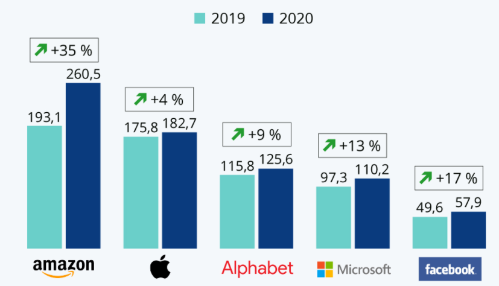

# GAFAM VS Covid-19 

Si 2020 est considérée comme une année noire pour les entreprises, les fameux GAFAM ont en bien profité. Les géants du numérique ont fait du confinement et des mesures de prévention de l'epédimie un terreau de croissance énorme. Leurs ventes ont grimpé de 18% au premier trimestre, et ce grâce au profit de l'essor du télétravail, de l'e-commerce et du divertissement digital. Sur les neuf premiers mois de l'année 2020, toutes les sociétés désignées par l'acronyme GAFAM ont enregistré une croissance de leurs revenus. Le graphe ci-dessous montre les chiffres d'affaires GAFAM des années 2019 et 2020.

## Quelles en sont les causes?

La pandémie n'a fait qu'accélérer une tendance de plus en présente dans l'ère moderne : celle des smartphones et des réseaux sociaux, du tout-numérique et de l'instantané. En effet, depuis le début de la pandémie, nos contacts sociaux les plus élémentaires ont été mis en veille. Tout le monde s'est orienté vers le travail à distance, la visioconférence et même vers des concerts virtuels. Les conditions ont donc fait que toute personne passe le maximum de temps possible derrière son écran, et c'est le modèle économique idéal pour les GAFAM.

