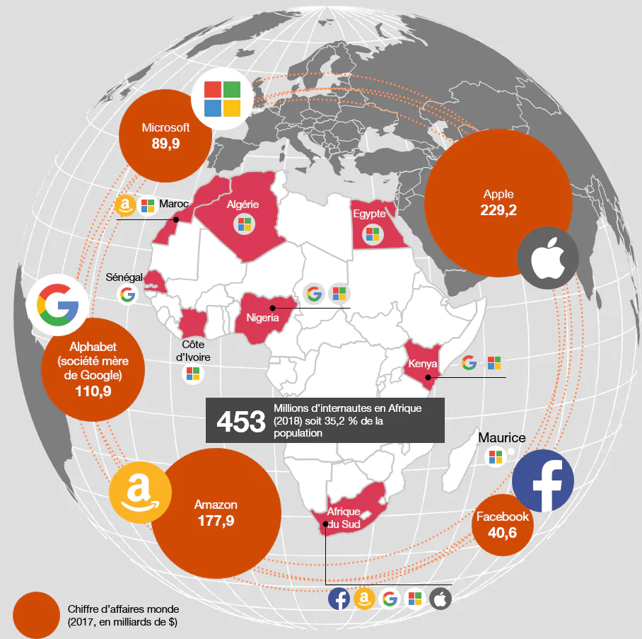

# GAFAM en Afrique

 L’Afrique souffre d’un gros souci de connectivité. De fait, c'est la région du monde la moins connectée au réseau, juste derrière l'Asie Pacifique et le Moyen-Orient. Moins de 30 % des Africains ont accès au haut débit mobile (contre 43 % en Asie Pacifique, avant dernier du classement, et 79 % en Amérique, en tête de liste) et seulement 15 % bénéficient d'un accès à Internet à domicile (contre 46 % en Asie Pacifique et 84 % en Europe)

 Le continent se heurte cependant à un problème de financement de cette phase de transition. Afin de ne pas se laisser dépasser par le temps, des fonds créés localement se développent, souvent sous forme de taxe sur les opérateurs téléphoniques. La logique de cette manoeuvre est simple : des entreprises comme par exemple Orange, Vodafone, MTN,Tigo ou Vodacom investissent dans la construction d’infrastructures permettant de relier au réseau des régions déconnectées. Une fois connectées, ces populations ont accès aux services de ces entreprises. Comme souvent, les premiers venus sont les premiers servis.

Persuadés du fort potentiel que représente le marché africain dans le secteur du digital, depuis plusieurs mois, des investisseurs étrangers de taille ont déclaré vouloir miser gros sur l’Afrique : les GAFAM.

## Quelles conséquences pour l'Afrique ?
Qu’il s’agisse de la collecte et du contrôle des données personnelles, du financement des start-up ou de la formation des développeurs, il y a une forme de colonisation numérique dont on ne parle que très peu.

> D’un côté, les Africains ont besoin de ces infrastructures et de cette connexion pour rattraper leur retard de développement. Mais, de l’autre, ce ne sont pas eux qui produisent les technologies et maîtrisent les données personnelles récoltées. Il y a bien une volonté politique d’aller vers une plus grande souveraineté numérique, de lever des fonds et de lancer des projets, mais ce n'est pas encore suffisant.
>   -- <cite>Samir Abdelkrim, écrivain et reporter spécialisé dans les nouvelles technologies pour le journal Le Monde,</cite>

Entre avancer seule ou accompagnée, attirer des investisseurs locaux ou internationaux, former ou laisser les entreprises étrangères former les talents, marcher à son rythme ou courir à celui des autres, l’Afrique se trouve actuellement à un moment décisif dans l’histoire de son développement technologique. Les décisions d’aujourd’hui détermineront la place qu’occupera le continent dans le secteur de l’IA de demain.