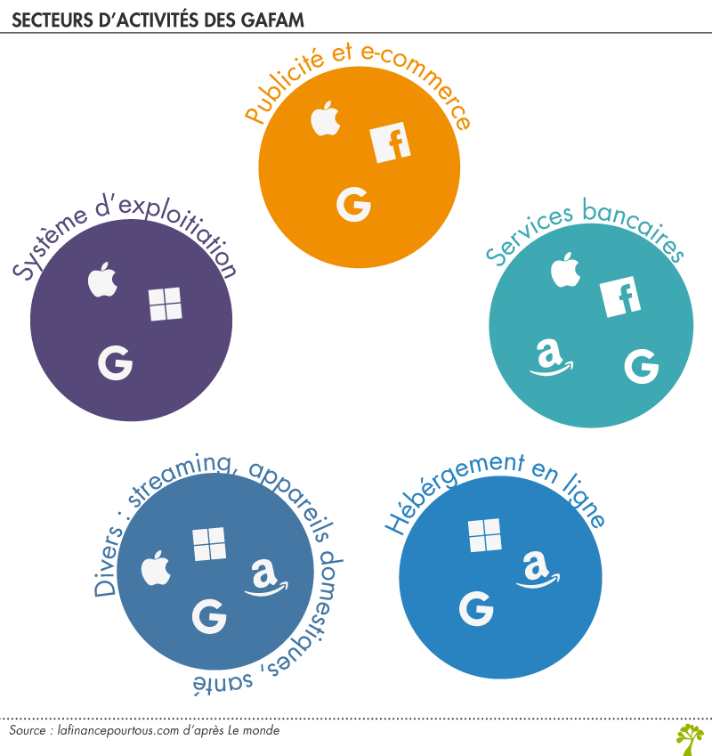

# Concurrence entre les GAFAM

Il y a quelques années, chacun des GAFAM disposait de son propre marché : la publicité sur les recherches pour Google, sur les réseaux sociaux pour Facebook, l’e-commerce pour Amazon et les produits électroniques pour Apple. Mais il semblerait que ce temps soit révolu puisque les géants du numérique débordent à présent de leurs secteurs initiaux où ils étaient pourtant en quasi-monopoles.

Les services bancaires sont par exemple l’un des nouveaux secteurs où les GAFAM se font concurrence. Services de paiement, offre de comptes courants, cartes de crédit, et même, une cryptomonnaie mondiale : les GAFAM regorgent d’inventivité pour se positionner sur le secteur financier. Mais ce n’est pas tout, le streaming, les objets connectés, la santé, etc. : les GAFAM se diversifient, quitte à se faire concurrence sur de mêmes activités.

## Principales sources de revenus des GAFAM :

| | Google | Apple | Facebook | Amazon | Microsoft |
| --- | --- | --- | --- | --- | --- |
| Sources de revenus | Publicité 88%   Autres 22% | iPhone 63%   Services 11%   Mac 11%   iPad 10%   Autres 5% | Publicité 93%   Autres 7% | Produits 72%   Media 18%   Cloud 9%   Autres 1% | Windows 9%   Office 28%   Server/Azure 22%   Xbox 11%   Publicité 7%   Autres 23% |

## Table de concurrence :

Si l'on dresse le tableau de concurrence des GAFAM, on constate que les autres sociétés entre elles apparaissent presque explicitement comme des concurrents. Dans l'identification des concurrents d'Amazon, par exemple, il est facile d'identifier Google au point 3, tout comme on peut voir au point 5 qu'il s'agit d'Apple. Dans le cas de Google, le point 2 fait référence à Amazon et le point 3 à Facebook. Sur la liste de Facebook, le point 1 fait référence à Google et les points 2 et 3 à Apple et à Amazon ; dans le cas d'Apple, il est fait indirectement référence à Facebook et à Amazon.

| Google | Apple | Facebook | Amazon | Microsoft |
| --- | --- | --- | --- | --- |
| 1. Physical-world retailers, publishers, (…) of our products.   2. Other online e-commerce and mobile e-commerce sites.   3. Media companies, web portals, comparison shopping websites, web search engines, and social networks.   4. Companies that provide e-commerce services, including website development, fulfillment, customer service, and payment processing; companies that provide information storage or computing services.   5. Companies that design, manufacture, market, or sell consumer electronics, telecommunication, and electronic devices. | 1. General purpose search engines   2. Vertical search engines and e-commerce websites (Kayak, Linkedin, Amazon, etc.)   3. “Social networks, such as Facebook and Twitter”.   4. Other forms of advertising, (television, radio, … )   5. Other online advertising platforms like Facebook, that compete for advertisers with AdWords   6. Providers of online products and services that provide answers, information, and services (GAFA) | 1. Diversified global companies with significant R&D resources (GAFA)   2. Platform-based ecosystems: competing vertically-integrated model: (Google, Apple)   3. Marketplaces (sometimes refer. to as “stores”) with scale and significant installed bases on mobile devices (Google, Amazon, Apple).   4. Companies based on a growing variety of business models: license-based proprietary software model; free appl., online services and content, and make money by selling third-party advertising (Media, Google, Facebook); open source business model | 1. Hardware   2. Digital electronic devices   3. Software (Microsoft, Google)   4. Online services and distribution of digital content and applications (Google, Facebook, Amazon) | 1.Companies that replicate the range of communications and related capabilities Facebook provide, like Google +   2. Mobile applications (messaging, photo- and video-sharing)   3. Web and mobile-based information and entertainment products and services that are designed to engage people and capture time spent online and on mobile devices   4. Traditional, online, and mobile businesses providing media for marketers to reach their audiences |