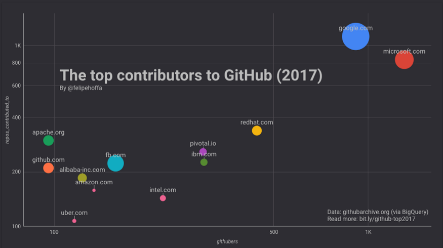

**La guerre des GAFAM et de l’opensource n’aura pas lieu.**
Très médiatisé, le rachat de GitHub, principale plateforme d’hébergement et de développement de logiciels, par Microsoft a créé la surprise. Suscitant certaines inquiétudes sur l’indépendance de la plus grande communauté de codeurs, cette opération marque surtout l’engouement du géant des solutions propriétaires pour l’opensource, qu’il qualifia longtemps de "cancer".

Cet épisode permet plus largement de revenir sur l’implication des GAFAM dans l’opensource, loin du fantasme d’une lutte violente entre ces deux univers a priori opposés.

Le graphe ci-dessous représente les contributeurs les plus actifs sur GitHub, et montre le poids des GAFAM dans cette communauté : Google et Microsoft sont de très loin les premiers contributeurs, Amazon et Facebook étant également bien représentés.

