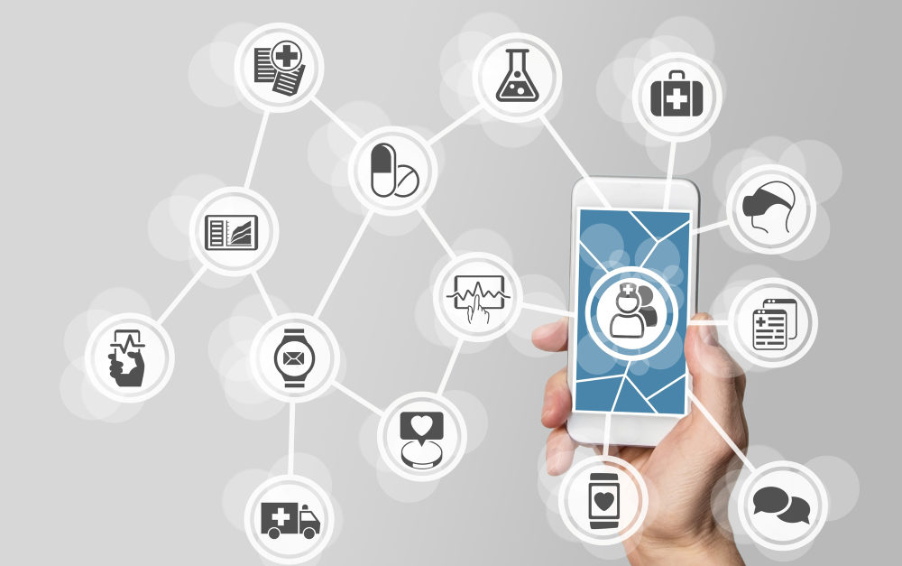

# GAFAM, Big Data et santé

## Pourquoi les GAFA s’intéressent-ils à la santé ?

Les structures telles que Google et Facebook, mis à part leurs volets publicités, se nourrissent d’informations. Grâce aux informations que nous laissons sur ces plateformes, elles connaissent en effet nos relations, nos habitudes, nos centres d’intérêts, les produits dont nous avons besoin et même notre état de santé. La santé étant un sujet qui sera toujours au cœur des préoccupations de tout être humain, il n’est pas surprenant de voir l’intérêt que les GAFA lui portent.

Mais outre son côté humain, la santé représente aussi un marché juteux pour les GAFA et leurs investissements dans le secteur sont assez impressionnants. A titre d’exemple, Google vient de racheter Fitbit, le spécialiste des bracelets connectés dédiés à l’usage médical pour un coût de 2,1 milliards de dollars. Par cet investissement, Google entend entrer en concurrence avec Apple qui tient 38% des parts de marchés des objets connectés pour le moment.

Selon les études du cabinet IDC, le marché des bracelets connectés accuse une croissance de 28,8% en un an. Par ailleurs, les données de santé intéressent aussi les GAFA qui nouent des partenariats notamment avec les assurances pour développer leurs services. Le partenariat d’Apple avec l’assureur Aetna en est une parfaite illustration. La marque à la pomme a créé pour Aetna une application qui lui permet de suivre l’état de santé de ses assurés en se servant de l’Apple Watch.

## Question des données personnelles
Le seul souci avec l’implication des opérateurs du numérique dans le domaine de la santé reste la protection des données personnelles. Google a tenu à souligner lors de l’acquisition de Fitbit que les données qu’il y récolterait ne serviront pas à ses activités publicitaires. Néanmoins, quand on connaît le côté mercantile des GAFA, on est quand même amenés à se demander si nos données sont bien à l’abri de tout usage commercial. Quel que soit l’objectif du projet que les opérateurs du numérique et de la santé se soient donnés, la confidentialité des données doivent se trouver au cœur de leurs préoccupations pour la sécurité des patients. 